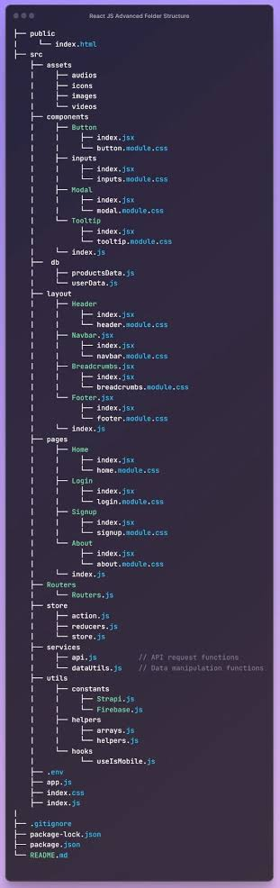
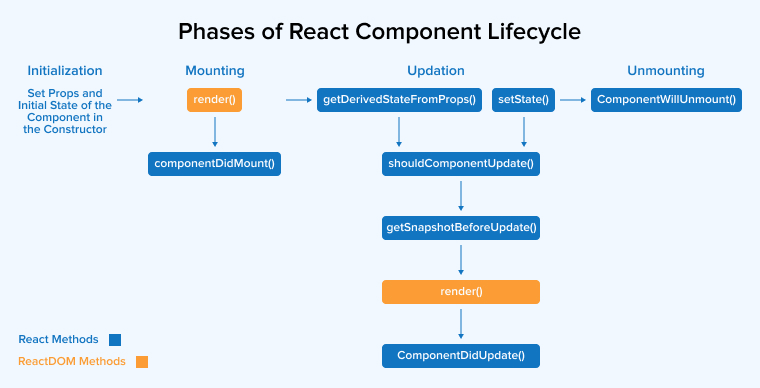

++++++++++++++++++++++++++++++++++++++++++++++++++++++++++++++++++++++++++++++++++++++
# HTML
++++++++++++++++++++++++++++++++++++++++++++++++++++++++++++++++++++++++++++++++++++++
    HTML is the standard markup language for creating web pages. 
    Follows W3C standards.

++++++++++++++++++++++++++++++++++++++++++++++++++++++++++++++++++++++++++++++++++++++

# CSS
++++++++++++++++++++++++++++++++++++++++++++++++++++++++++++++++

Color:-

- [Color Hex Code](https://colorhunt.co/)
- [Gradient Color](https://mycolor.space/gradient,https://uigradients.com/#DirtyFog)
- [Shapes](https://9elements.github.io/fancy-border-radius/,https://10015.io/tools/css-border-radius-generator)
- [Loader CSS](https://css-loaders.com/)

++++++++++++++++++++++++++++++++++++++++++++++++++++++++++++++++++++++++++++++++++++++
# JavaScript/JS Basics - "Javascript/JS is dynamic scripting language"

1. Javascript/JS is dynamic scripting language.

   a. Visual Studio Code(IDE-Integrated Development Environment)
   b. Javascript can be run in browser Dev Tool CONSOLE(client-side) but due to NodeJS(Open Source , cross-platform, JavaScript runtime environment)  uses Chrome V8 Engines internally environment to run Javascript code at runtime in VS Code terminal through below cmd.
    
        e.g.:-

            ```js
                node first.js
            ```
  Explanation:-

    1.1. var keyword type variable.

    a. Dynamic means the variable type e.g. var i whose value can be re-declared, and it can be changed at any time based on value assigned.
    
        e.g:- 

            ```js
                var i=10;  --means now i stores integer value

                i="a"; --means now i stores string value                
            ```


    b. var is function/global scope means re-declaring the same variable gives last assigned value anywhere within function scope.

        e.g.:-

            ```js
                var i=10;  
                var i="a";  --now i stores string value

                console.log(i);  --Output is a
            ``` 
    c. var support HOSTING concept, which means the variable can be used before its declaration. It gives as undefined value but not error as var type variable is  defined after using it.
        
        e.g.:-

            ```js
              console.log(i);  --Used before declaration ,which gives value as undefined but not error as while code is scan internally var type variable is hoisted(means declaration is moved at top but not seen).
              
              var i=20;
            ```

  (Imp:- Due to which ES6(ES2015) introduced let and const keywords for variable declaration.
         ES means EcmaScript)

   1.2. let keyword type variable.

   a. Block scope means the variable value is limited to the block in which it is defined.

   b. It can be re-assigned and re-declared within the same datatype value, assigning different datatype value is not allowed.

   1.3. const keyword type variable.

   a. Block scope means the variable value is limited to the block in which it is defined.

   b. It can be re-assigned and re-declared within the same datatype value, assigning different datatype value is not allowed.

   (Imp:- let and const are same and maximum used for runtime errors)

2. Looping concepts:-

        e.g.:-

            ```js
               let arr=[1,2,3,4,5];
            ```

    2.1. for loop
    2.2. for...in loop  --looping index of array/collection
           
        e.g.:-

           ```js
                for(let num in arr){
                    console.log(num);  // index
                    console.log(arr[num]);  // value
                }
           ```

    2.3. for...of loop   --looping value of array/collection

        e.g.:-

          ```js 
               for(let num of arr){
                   console.log(num);  // value
               }
          ```

    2.4. while loop
    2.5. do...while loop

3.  Working/Processing on Objects

    3.1. Destructuring Object Properties:-

    Destructuring is a way to extract properties from an object and assign them to variables.

    It allows you to unpack values from arrays or properties from objects into distinct variables.

    e.g.

         ```js
            
            const obj={id:1,name:"a",age:25};

            const {id,name,age}=obj;

            console.log(id);   //1
            console.log(name); //a
            console.log(age);  //25
        
         ```

    ******************************************

    3.2. Spread Operator expand collection, array & object.

    3.2.1 Collection or Array(Merge Element of same type in below case array1 & array2 is type array):-

    e.g.

         ```js

            var array1=["a","b","c"];
            var array2=["x","y","z"];

            var mergearray1=[...array1,"x"];
            var mergearray12=[...array1,...array2];

            console.log(mergearray1);           //["a","b","c","x"]
            console.log(mergearray12);          //["a","b","c","x","y","z"]
            
         ```

    3.2.2 Object(Update Object Property):-

    e.g.

        ```js

            const obj={id:1,name:"a"};
            const obj1={...obj,id:2,name:"b"};

            console.log(obj1)  // {id:2,name:"b"}   //Expand object properties to update value of required property

        ```

4. Logic on collection by using method map(),filter() and reduce()

    e.g.

        ```js
            const users=[{ id: 1, name: "Alice", age: 25 },
                         { id: 2, name: "Bob", age: 35 }]
        ```

        4.1. map():- Used for looping in a collection or array.
        	e.g.

                ```js
                    users.map((u)=><User name={u.name} age={u.age}>)
                ```

        4.2. filter():- It's like a WHERE condition to get a customized collection based on the condition
        	 e.g.

                ```js
                    users.filter((u)=>u.age<35)
                ```

        4.3. reduce():- It does computation on the collection and returns the required value
        	e.g.

                ```js
                    users.reduce((derivedCalculatedValue,u)=>{return derivedCalculatedValue + u.age},0)
                ```

++++++++++++++++++++++++++++++++++++++++++++++++++++++++++++++++++++++++++++++++++++++++


# React Using VS Code With Vite
++++++++++++++++++++++++++++++++++++++++++++++++++++++++++++++++
++++++++++++++++++++++++++++++++++++++++++++++++++++++++++++++++

## Reference Docs 

### Official Sites
++++++++++++++++++++++++++++++++++++++++++++++++++++++++++++++++
- https://javascript.info/
- https://www.geeksforgeeks.org/installation-of-node-js-on-windows/
- https://www.npmjs.com/package/create-react-app
- https://react.dev/learn
- https://vitejs.dev/guide/features.html


This template provides a minimal setup to get React working in Vite with HMR and some ESLint rules.

Currently, two official plugins are available:

- [@vitejs/plugin-react](https://github.com/vitejs/vite-plugin-react/blob/main/packages/plugin-react) uses [Babel](https://babeljs.io/) for Fast Refresh
- [@vitejs/plugin-react-swc](https://github.com/vitejs/vite-plugin-react/blob/main/packages/plugin-react-swc) uses [SWC](https://swc.rs/) for Fast Refresh

++++++++++++++++++++++++++++++++++++++++++++++++++++++++++++++++


## Vite 
++++++++++++++++++++++++++++++++++++++++++++++++++++++++++++++++

### ESLint configuration
++++++++++++++++++++++++++++++++++++++++++++++++++++++++++++++++

If you are developing a production application, we recommend using TypeScript with type-aware lint rules enabled. Check out the [TS template](https://github.com/vitejs/vite/tree/main/packages/create-vite/template-react-ts) for information on how to integrate TypeScript and [`typescript-eslint`](https://typescript-eslint.io) in your project.

++++++++++++++++++++++++++++++++++++++++++++++++++++++++++++++++

## VS Code Editor/IDE/Code Development Platform :-
++++++++++++++++++++++++++++++++++++++++++++++++++++++++++++++++

### Shortcuts
++++++++++++++++++++++++++++++++++++++++++++++++++++++++++++++++
 
 1. Terminal show/hide(cntrl+`)
 2. Solution File/Folder Structure show/hide(cntrl+b)
 3. Focus on top search(cntrl+p, cntrl+shift+p)
 4. Format jsx,json :- shift+alt+f

+++++++++++++++++++++++++++++++++++++++++++++++++++++++++++++++++


### Terminal CMD's To Create and Manage Files
++++++++++++++++++++++++++++++++++++++++++++++++++++++++++++++++

#### How to create a file and folder through the Terminal cmd.
a. Move inside into folder
cd <FolderName>
b. Move outside the folder
cd..
c. Create folder
mkdir <NewFolderName>
d. Create any type of file, such as JSX, JSON, CSS, or image.
code <NewFileName.extension>
e. To open the current folder in Explorer from the terminal, type
explorer .

----------------------------------------------------------------

### Pre-requisite(Setup Development Environment For React v19) Using Terminal Option of VS Code Editor:-

++++++++++++++++++++++++++++++++++++++++++++++++++++++++++++++++++++++++++

#### Step 1: Installing Node.js (Open Source, cross-platform, JavaScript runtime environment)
Node.js is essential for running React applications.

Follow these steps to install Node.js:

1. Download and install LTS version suitable for your operating system from the [official website](https://nodejs.org/).

++++++++++++++++++++++++++++++++++++++++++++++++++++++++++++++++++++++++++

#### Step 2:- Setup VS Code

1. Download and install Visual Studio Code from the [official website](https://code.visualstudio.com/).
2. Install the recommended extensions for React development:

   A. Browser Chrome Extension:-
        2.1 React Developer Tool

   B. VS Code Editor Extensions:-
        2.1. Auto Close Tag
        2.2. Auto Comment
        2.3. Auto Import
        2.4. Auto Rename Tag
        2.5. Babel JavaScript
        2.6. Better Comments
        2.7. Bootstrap 5 Quick Snippets
        2.8. Bootstrap Class Autocomplete
        2.9. Bootstrap IntelliSense
        2.10. Code Runner
        2.11. Code Spell Checker
        2.12. CSS Navigation
        2.13. CSS Peek
        2.14. css-auto-prefix
        2.15. ES7+ React/Redux/React-Native snippets
        2.16. ESLint
        2.17. GitHub Copilot
        2.18. GitHub Copilot Chat
        2.19. GitHub Pull Requests
        2.20. Import Cost
        2.21. IntelliCode
        2.22. JavaScript (ES6) code snippets
        2.23. Live Server
        2.24. Markdown All in One
        2.25. Markdown Preview Enhanced
        2.26. npm Intellisense
        2.27. Path Intellisense
        2.28. Prettier - Code formatter
        2.29. React PropTypes Generate
        2.30. Reactjs code snippets
        2.31. Tailwind CSS IntelliSense
        2.32. Thunder Client
        2.33. vscode-icons


++++++++++++++++++++++++++++++++++++++++++++++++++++++++++++++++++++++++++

#### Step 3:- Setup Package Manager

##### NPM (Node Package Manager)

NPM (Node Package Manager) is included with Node.js installation. You can verify its installation by checking the version.

Version Check:-

```terminal
    node -v
    npm -v 


    npx npm-check-updates (To verify all packages listed with their current and latest available version)
    npx npm-check-updates -u (To update all packages to the latest version, listing with their older version in the previous npx command)

```

##### BUN  (Latest, Lightweight, Faster Built as compare to NPM)

Bun is a modern JavaScript runtime and package manager that focuses on speed and efficiency. It is designed to be a drop-in replacement for npm and yarn, with a focus on performance.

Install:-

```terminal
    npm install -g bun 
```
    OR
```terminal
    npm i -g bun 
```

(Make sure to add -g flag for system level global installation)


Version Check:-
```terminal
    bun -v

    bun pm ls (To view all installed packages with version)
```

+++++++++++++++++++++++++++++++++++++++++++++++++++++++++++++++++++++++++
#### Step 4: Upgrading to React v19 RC

If you're using React v18 and want to upgrade to React v19 Release Candidate, follow these steps:

Open your terminal or command prompt.
Run the following command to update React:

```terminal
    npm install react@rc
    npm install react-dom@rc
    npm install react-router-dom@rc
```
+++++++++++++++++++++++++++++++++++++++++++++++++++++++++++++++++++++++++

#### Step 5: Creating a React App with Vite

Vite is a build tool in v19 replacement to webpack that aims to provide a faster and leaner development experience/environment for building modern web projects.

Follow these steps to create your first React app:

Open your terminal or command prompt.
Run the following commands to create a new React project with Vite:

(Note:- npm i create-react-app (Not Use Instead use npm create vite@latest))

```terminal
    npm create vite@latest reactapp --template react
    cd reactapp
    npm install
```

Start the development server:

```terminal
    npm run dev
```
+++++++++++++++++++++++++++++++++++++++++++++++++++++++++++++++

## Project Deployment/Publishing/Hosting :-
+++++++++++++++++++++++++++++++++++++++++++++++++++++++++++++++

### Manual Deployment :- Publish Local Folder/Files Then Manual Deploy To Free Hosting Site.  

Use free hosting site:- [official website](https://app.netlify.com/) (Use GitHub login)

Steps:-

1.  To create Production Build/Version to deploy

    ```terminal
        npm run build
    ```

2. After above cmd executed successfully dist folder is create.

3. Go to netlify site in side menu select & click Projects it will display list of methods to deployed website.

4. Select Deploy Manual option in list then Drag & Drop OR Upload Files ,then go to folder path where dist folder is created within project that you want to host

5. Open dist folder you will see all files that are going to deploy.

6. Then hit Upload/Deploy/Ok button of dialog & wait don't refresh till files gets completely deployed.

7. After successful deploy at top you will see random project and netlify.app which you can modify by clicking on Project Configuration & then change name as required.

--------------------------------------------------------------------------

### Synchronous/Auto Deployment:- Sync Local VS Code Repository with GitHub Repository Which Then Automatically Deploy To Free Hosting Site.


#### Upload Files from VS Code to GitHub:-

    1. In GitHub, first log in to your GitHub account, then in the  tab Repositories, click on the New button & create a  repository by giving a  Repository Name
       e.g. Yogesh_Matkar/<repository name> then click Create Repository button.

    2. Install git external installer from [official website](https://git-scm.com/) 
       Install git and then restart VS Code,to execute git cmd's in VS Code terminal as required

      a.
        ```terminal
            git init
        ```

       If the git cmd issues, then check the  git version using cmd.
    
        ```terminal
            git --version
        ```

      b. If the version is not displayed or again a git cmd issue, that means git is not installed, then install the Git Package Manager  on the computer.

      c. After installation, in VS Code to get cmd setting UI, press Ctrl+Shift+P, type in search Open User Settings (JSON) and click,
      Then add a set of values in JSON format below,

       "git.enable": True,
       "git.path": "C:\\Program Files\\Git\\cmd\\git.exe.exe"

      d. Then, try the below cmd to check if git is properly enabled in VS Code,

         To check the installed version of git
         
         ```terminal
             git --version
         ```
      e. To initialize git in VS Code
         
         ```terminal
             git init
         ```

         Due to the above cmd of initialise in the left sidebar menu, one option of the Branch icon(Source Control), in which files were modified with U(Update) as the letter means these files are modified

      f. If you want to remove/ignore some file from pushing into git, then in the .gitignore file, mention the file extension/file name/folder name

      g. After that, for staging file changes cmd

        Stage All Files:-
        
        ```terminal
             git add .         (. means all files staged)
        ```

        Stage Specific Files:-

        ```terminal
             git add filename1.txt filename1.jsx
        ```         

      h. After the above cmd file is moved from CHANGES to Staged Changes, with each file with A as a letter, means these files are going to be added to be final step before going to push in git

        Committing Changes:-

        ```terminal
            git commit -m "<commit comments>"
        ```

      i. Then adding the origin of the remote git repository means connecting VS Code to a specific remote git repository path using the below cmd

        ```terminal
             git remote add origin <repository-url>
        ```
        Repository-URL:-(https://github.com/Yogesh-K-Matkar/deploy_react_app_example1.git)

     j. Then, below cmd to push the final code to the specific active branch master/main

         ```terminal
            git push origin <active branch name>
         ```
                   

     k. Refresh the GitHub repository of the project deployed, and it will show all published files.

#### Deploying from GitHub to Netlify:-

    a. In Netlify, Add New Project --> Import an existing project --> Select Repository Application Name(GitHub) --> All Repositories

    b. Selecting All repositories, a list of all deployed GitHub repositories is displayed.

    c. Select the repository that needs to be hosted in Netlify

       Write in Build Command(As per defined in package.json--> script --> build)

       bun run build

    d. If the .env variable file in the React project is available, then add the  Environment Variable by clicking on the Add Environment Variables button


+++++++++++++++++++++++++++++++++++++++++++++++++++++++++++++++

## Project Cloning and Pull Request From GitHub to VS Code As Local Repository
+++++++++++++++++++++++++++++++++++++++++++++++++++++++++++++++
 
### Cloning:-

      a. First, install Extension- GitHub Pull Requests, then through Settings open Command Palette and write GitHub Clone(Clone from GitHub)

      b. Then visit to GitHub account-->Select the repository, and copy the  browser URL of the repository, then need to clone it to VS Code.

      c. Now, explorer dialogue windows open --> select the folder where we want to clone the repository.

### Pull Request :-

     a. Sync the local exisitng project with repository from GitHub VS Code Terminal cmd

        ```terminal
            git pull origin main
        ```

+++++++++++++++++++++++++++++++++++++++++++++++++++++++++++++

## REACT/REACTJS Language:-(v19)

+++++++++++++++++++++++++++++++++++++++++++++++++++++++++++++

A. What is React/ReactJS:-

1. ReactJS is a JavaScript Library used for front-end/UI development using reusable UI components.
   
2. It was first created by a Facebook developer(Jordan Walke) when they faced the issue of managing and maintaining the extensive increase of the Facebook application in 2011.
   
3. It was first implemented in their application Facebook in modules like Feeds, Chat Messaging and also made ReactJS Open Source to the outside world in 2012 and 2013, but suffered from criticism as the outside world was unable to properly understand the Separation Of Code(SOC) concept of ReactJS.
   
4. So then in 2013, one of the Khan Academy developer created a Web Application & achieved success in it. She is the first Non-Facebook React developer, due to which Facebook got a larger success and breakthrough in the outside world for ReactJS language usage & at the same time, Facebook developers create a web application for the Instagram Mobile App.
   
5. ReactJS is a Declarative Language, so faster to implement.
   
6. Component-Based Architecture.
   
7. Rich Eco-System-npm packages(Smaller concept/modules already develop in form of packages)
   
8. Strong & Large community support-Online/GitHub

9. It's only JavaScript Library, not a full-fledged framework like Angular or Vue.js, which makes it more flexible and lightweight for developers.

10. To make it a full-fledged framework, React can be used in conjunction with other libraries and tools, such as Redux for state management and React Router for routing.

11. NextJS encapsulate front-end ReactJS to form a complete full-stack framework.

++++++++++++++++++++++++++++++++++++++++++++++++++++++++++++++++++++++++++++++++++++++++
### React Folder Structure:-
++++++++++++++++++++++++++++++++++++++++++++++++++++++++++++++++++++++++++++++++++++++++
 


++++++++++++++++++++++++++++++++++++++++++++++++++++++++++++++++++++++++++++++++++++++++

### React Concepts:-
++++++++++++++++++++++++++++++++++++++++++++++++++++++++++++++++++++++++++++++++++++++++

    Evolution:- ReactJS is Javascript library used for front-end development by using reusable UI components.
                
                It doesn't provide framework that's why lightweight, so Angular comes into picture which provide both Javascript Library and Framework.  
                
                But ReactJS is only Javascript Library so it encapsulated in NextJS framework to form a complete full-stack framework to provide development Speed, Scalability & Simplicity.

1.  DOM Reconciliation / Diffing Algorithm:  
    React uses a Virtual DOM to efficiently update the UI. When a component's state changes, React creates a new Virtual DOM tree by Babel and compares it with the previous one to determine the minimal set of changes needed to update the actual DOM.

2.  React.StrictMode:-
    It is a tool for highlighting potential problems in an application. It activates additional checks and warnings for its descendants.

    It helps to identify components with unsafe life-cycles, legacy API usage, and other side effects.

    Syntax:- Wrap the entire application with <React.StrictMode> tag

    Syntax:

        ```jsx
        import React from 'react';
        <React.StrictMode>
            <App />
        </React.StrictMode>
        ```

3.  Each JSX element/expression must combine/enclosed using one parent JSX element, which means if you try to return multiple elements

    React will throw an error.

    Error: Adjacent JSX elements must be wrapped in an enclosing tag.

4.  To avoid using a non-required < div > tag to combine multiple elements into one before returning JSX from the component function, and also to avoid DOM to create an unwanted < div > element.
    Then comes the React concept of Fragments,

    e.g.

        ```jsx

            const ComponentName=()=>
            {
                return(
                      <>
                        <div>jsx multiple elements</div>
                      </>
                );
            }

        ```

5.  Every JSX tag needs to be closed. You can use self-closing tags for elements that don't have children

    e.g.

        ```jsx
            
        ```

6.  Concept of dynamic variable where we can assign derived value generated from JS function, expression or operations that can be shown at a specific location with JSX.

7.  Concept of logical variable where we can assign derived value generated from JS function, expression or operations that can be shown at a specific location with JSX based on a Condition using Conditional Operators/Logic such as Ternary, IF-ELSE block, etc.

8.  Types of Component:- 2 Types of Component Declaration

    8.1. Class Component:- ES6 classes extending React.Component. Uses render method and state.Legacy projects only.

    

         Lifecycle:- Three main phases:

         8.1.1 Mounting Phase

                This phase occurs when a component is first created and inserted into the DOM. It involves initial setup and rendering.

                constructor(props): Initializes state and binds event handlers (only in class components).

                static getDerivedStateFromProps(props, state): Sync state to props before rendering.

                render(): Returns the JSX to build the UI.

                componentDidMount(): Runs after the component is mounted to the DOM, useful for side effects like data fetching or setting up subscriptions.

         8.1.2 Updating Phase

                This happens whenever the component's props or state change, triggering a re-render.

                static getDerivedStateFromProps(props, state): Called during updates to sync state to new props.

                shouldComponentUpdate(nextProps, nextState): Determines if component should re-render (returning false skips update).

                render(): Re-renders the component.

                getSnapshotBeforeUpdate(prevProps, prevState): Captures information before DOM updates (e.g., scroll position).

                componentDidUpdate(prevProps, prevState, snapshot): Runs after updates, suitable for DOM operations or fetching new data.

         8.1.3 Unmounting Phase

                This phase occurs when the component is removed from the DOM and is used for cleanup.

                componentWillUnmount(): Called right before the component is removed, where you can clear timers, cancel network requests, or remove event listeners.

    8.2. Functional Component:-JS functions returning JSX. With Hooks, can manage state and effects.Preferred currently in projects.

         Functional components do not have these explicit lifecycle methods but achieve similar effects using React Hooks:

        useEffect hook replaces componentDidMount, componentDidUpdate, and componentWillUnmount. You can specify when the effect runs and perform cleanup by returning a cleanup function.

9. Types of Functional Component:-

    9.1. Default Functional Component :- In case of importing the Export Default component, then while importing any component name be used without curly braces.

    Syntax:

         ```jsx
         import NetflixSeries from "./components/NetflixSeries";
         ```
         (Where export component name is NetflixSeries)

    9.2. Named Functional Component :- In case of importing Export Named component, then while importing the same Component name to be used with curly braces.

    Syntax:

         ```jsx
         import { NetflixSeries } from "./components/NetflixSeries";
         ```
         (Where export component name is NetflixSeries)

     9.3. Combining Default and Named Exports: In case of importing Export Default and Named component, then while importing the same Default Component and Named Component name from single same .jsx file.

    Syntax:

         ```jsx
            import Series, { NetflixSeries } from "./components/NetflixSeries";
         ```
         (Where export default component is Series and named component is NetflixSeries from NetflixSeries.jsx file)


10. Define/Use imported Components/Component from another JSX(ReactFrameworkApp.jsx) as below

    e.g.

        ```jsx
            < ReactApp / > (Component)
        ```

11. To avoid rewriting/redundancy of the same code multiple times, create a single component and reuse it multiple times where required in the same JSX or another JSX
    (import component function from a particular JSX where the component function is defined).

12. Instead of FOR/FOREACH loop their is map() for looping on collection/array. In React map(), each element must have a key prop to differentiate each element generated while looping using map().

13. Props is way of passing attributes as parameter to Component in React, and can be passed from a unidirectional(1-direction) Parent component to calling child components as separate properties and consumed in the child component as props as a parameter that combines all properties of the child component defined by the Parent component while calling the Child component, except the key property.

14. While passing the integer value prop/attribute over the child component, pass it like this

    14.1. Integer prop/attribute over child component pass like this

        e.g.

            ```jsx
                < ReactComponent id={integer_value} / > 
            ```

    14.2. String value prop/attribute over child component pass like this

        e.g.        

            ```jsx
                < ReactComponent name="string_value" / >
            ```

    (IMP:- As per ECMAScript (ES6) rule, if in an object structure like { Name: Name }, when key and value are the same, then define the object like this {Name})

15. To pass HTML content as JSX/string within opening and closing component tags, then a special prop is used, denoted as children, to access those elements.

    e.g.

        ```jsx
            const ReactComponent=(props)=>{
                const { children } = props;
            }
        ```

16. CSS Style- grid or flex-box. CSS always give it to the parent tag.
    Instead of defining a class prop for applying a CSS class, use the className prop.

    Types of CSS:-

    16.1. Normal CSS consider using the className prop.

    16.2. Inline CSS consider value as an object defined within { object } for the style prop

    e.g.

        ```jsx
            < ReactComponent style={{ margin: "1.2rem 0" }} / > 
        ```

                OR

        Define the style object separately, then define it as a variable and then use it in the style prop

        ```jsx
            const btn_style = { margin: "1.2rem 0" };                
            < ReactComponent style={btn_style} / > 
        ```


    16.3. Conditionally applying CSS

    16.3.1. Based on the Ternary operator, apply styling

    e.g.

        ```jsx
            < ReactComponent className={i>0?"className1": "className2"} / > 
        ```

    16.3.2. When you want to append a className with a condition that derives another className based on the condition,
    meaning append a string with an expression done below by using Template Literal

    e.g.

        ```jsx
            < ReactComponent className={`className1 ${i>0?"className2": "className3"}`} / > 
        ```         

    16.4. ModuleCSS:-
    Module CSS is a component-specific style and extension of a file is <filename>.module.css

    In Module CSS, each className is treated as a property of that specific module.css object

    
        ```jsx
             import cssModule from './<filename>.module.css'
        ```

    e.g. To access className abc, when className abc doesn't contain '-'

        ```jsx
                 < ReactComponent style={cssModule.abc} / > 
        ```

    e.g. To access className a-b-c, when className a-b-c contain '-'

        ```jsx
                 < ReactComponent style={cssModule["a-b-c"]} / > 
        ```                 

        Second way of defining classname commonly used.
        

    16.5. Using Tailwind v4 CSS (Third Party):-

    16.5.1. Install through Terminal cmd:-

        ```terminal
              npm install tailwindcss @tailwindcss/vite
        ```

    16.5.2. Configure the Vite plugin

        ```jsx

            import tailwindcss from '@tailwindcss/vite'

            export default defineConfig({
                plugins: [
                            tailwindcss(),
                         ],
            })
        ```

    16.5.3. Import Tailwind CSS

        ```css
            @import "tailwindcss";
        ```

    16.5.4. bun run dev

    (
    Notes:- In TailwindCSS,

    1. Need to you can set dynamic values within [], such as

    e.g.

        py-[3.2rem]

    2. If CSS is getting overridden by default CSS, then '!' symbol before each overridden CSS class

    e.g.

        !py-6

    )

17. Different Source of UI Controls :

    17.1. Styled-Components (Third Party):-
    In styled-component, first need to install using the Terminal cmd

    e.g.
        ```terminal
              bun install styled-components
        ```

    Import,
    e.g.

        ```jsx
            import styled from "styled-components"
        ```

    Then, using a styled object can access a React component and apply the style to it.

    2 ways to apply styled-components:-

    17.1.1. Template Literals:-
    
    e.g.

        ```jsx
            const Button=styled.button`color:grey`;
        ```

            style.button --> button is a tag, eg p, h, button, span

    17.1.2. Style Object:-

    e.g.

        ```jsx
            const Button=styled.button(
            {
                color: grey,        
            }
            );
        ```

    style.button --> button is a tag, eg p, h, button, span

18. Custom Error:-
    To show custom error message, use the below syntax

    e.g.

        ```jsx
            let customError=new Error("Custom Error Message");
        ```

19. Event Handler in JS, such as onClick, onChange, onSubmit, etc, which then call Syntactic Event Handler Function in React, should be written as a function name such as handleClick, handleChange,handleSubmit, etc
    This is known as the Syntactic Event Handler Function.

    Type Of Function:-

    19.1. Named Function is only calling the function name, not the function.
            
            onClick={handleButtonClick} (Not like this onClick={handleButtonClick()})
    e.g.

        ```jsx
            <button onClick={handleButtonClick}>Click Me</button>
        ```

    19.2. Arrow Function with event as parameter to get Syntactic Event object

    e.g.        

        ```jsx
            <button onClick={(event)=>handleButtonClick(event)}>Click Me</button>
        ```

    19.3. Inline Function With Syntactic Event Object

    e.g.        

        ```jsx
            <button onClick={(event) => console.log(event)}>Click Me</button>
        ```

    19.4. Inline Arrow Normal Function

    e.g.        

        ```jsx
            <button onClick={() =>{ console.log("Hi")}}>Click Me</button>
        ```

    19.5. Arrow function passing parameters/arguments

    e.g.       

        ```jsx
            <button onClick={(event) =>{ console.log(event,"Data to pass to Function")}}>Click Me</button>
        ```

20. Event Handler passing as props can be used in concepts such as Form Handling, User Interaction, State Management, and Callback Function.

21. Event Function is defined in Parent Component & passed as Props to Child Component, & then Child Component decides when to call Parent Component Event Function.
    So Parent Component pass Event Function as Props as Event Handler to the Child Component.

22. Event Propagation, propagate means moving & Event Propagation means moving each element and the occurrence of the event until it reaches the target event.

    Event Propagation has 3 components (Capture, Target & Bubbling)

    Type of Event Propagation:-

        22.1. Event Capture means propagating/moving from the Parent Element to the Target Action Element and triggering all occurrence event functions in the path while moving.

        22.2. Event Bubbling means propagating/moving from Target Action Element to Parent Element and triggering all occurrence event functions in the path while moving.

    But to avoid the unwanted triggering of Parent Component event functions other than the Target Action Event Function, we have to use

    e.g. Stop after triggering a single target event.

            ```jsx
                function handleButtonClick(event, txt){
                    event.stopPropagation();
                    console.log(txt);
                };


                <button onClick={(event) =>{ handleButtonClick(event, "Data to pass to Function")}}></button>
            ```

    If Target control is bind with multiple other event rather then onClick such as onChange,onBlur then to stop such events begin call.

    e.g.  Stop all other event after triggering a single target event.

            ```jsx
                function handleButtonClick(event, txt){
                    event.stopPropagation();
                    event.stopImmediatePropagation();
                    console.log(txt);
                };

                function handleChange(){
                    event.stopPropagation();
                    event.stopImmediatePropagation();
                };

                <button onClick={(event) =>{ handleButtonClick(event, "Data to pass to Function")}} onChange={(event) =>{ handleChange()}}></button>
            ```

23. Derived State means a variable value comes from a State Variable.

24. LiftingStateUp means when the state is defined in children and the same is needed by children at the same node level,
    so we need to move the state to its parent, where both children are calling. This can be done through passing a function as a prop to the child,
    where the value from the child is passed to the parent via the parent function passed as a prop to set the State in the parent.
    Then the same state is passed as a prop to another child that requires the same state value.

    That means State is common to multiple states at the same level of the child component.

25. React Icons for icons image from multiple sources(Font Awesome icons, Material UI icons, etc) at one place
    To access icons, first need to install using 

Terminal cmd

    e.g.

        ```terminal
            npm install react-icons --save
        ```

    Then import where needed to show the icon

    e.g.

        ```jsx
            import { IconComponentName } from "react-icons/io";
        ```

    Use the icon component where a specific icon is required within the component

        ```jsx
            <IconComponentName style={{color:"blue"}}/>
        ```

26. To store & retain any value on refresh of the browser without a database.

    e.g. To set:- 
    
        ```js
            localStorage.setItem("keyname","data");
        ```

    e.g. To get:- 
    
        ```js
            localStorage.getItem("keyname");
        ```

27. When any control is bound with a state variable(control is moving from uncontrolled to controlled). In React, most components are uncontrolled components by default unless their values are bound to a state variable..

    Controlled Data Hooks (Reflect changes immediately in DOM and on UI onChange - Sync Data - Operations:- Input value):- useState

    UnControlled Data Hooks (Does not reflect changes in DOM and not on UI onChange - Non-Sync Data - Operations:- Background values,timer):- useRefs

28. The 'use' prefixes in a function name is all React Hooks.

    Types Of Hooks:-

    28.1. State Management:-

        28.1.1. Simple Value State Management(Form simple values not more then 3 controls):-

          28.1.1.1 useState(State Management with re-rendering- Simple, local state mean state value scope remain in same single component where its defined,

                Scenario :- Use only when form is simple has not more then 2 to 3 inputs.):- The useState hook, when the state variable value gets updated, it renders the components where it is defined, such as form input, toggles, counters, fetched data flags, or UI visibility.

                For local state management inside a single component and it remains until the component is mounted.

                State Variable/Initial State Variable Value can store any type of value, such as {}-Object,[]-Array,""-String,1234-Number

                Syntax:-

                    ```jsx
                    import React, { useState, useEffect } from 'react';

                    const Counter = () => {
                        const [count, setCount] = useState(0);

                        useEffect(() => {
                            document.title = `You clicked ${count} times`;
                        }, [count]); // run effect only when count changes

                        return (
                            <div>
                                <p>You clicked {count} times</p>
                                <button onClick={() => setCount(count + 1)}>Click me</button>
                            </div>
                        );
                    }
                    ```

                    Imp:-

                    1. The effect updates the document title after every render where count changes.
                    2. If you omit [count], it would update after every render.
                    3. Passing an empty array [] would run it only once after the initial render.

            28.1.1.2. useRefs(DOM Manipulation without re-rendering, 
                Scenario :- Use only when form is simple has not more then 2 to 3 inputs.):- Built-in hook is used when control values are not tightly bound by any useState hook state variable, meaning an uncontrolled component.

                When you need to access or manipulate a DOM element directly (e.g., to manipulate input fields, focus elements, scroll positions, or perform animations imperatively).

                Persisting mutable values: Store values across renders (like timers, previous state values, or any mutable data) without triggering re-render.

                In React, we can access the control using the document.getElementById() method, such as

                Syntax:-

                    ```jsx
                    import React, { useRef } from 'react';

                    const TextInput = () => {
                        const inputRef = useRef(null);

                        const focusInput = () => {
                            inputRef.current.focus();  // Imperatively focus the input

                            console.log(inputRef.current.value);  // Access the input value

                        };

                        return (
                            <div>
                                <input ref={inputRef} type="text" placeholder="Click button to focus me" />
                                <button onClick={focusInput}>Focus Input</button>
                            </div>
                        );
                    }

                    export default TextInput;
                    ```
                    Here, inputRef points to the DOM <input> element.

                    Clicking the button calls focusInput which focuses the input directly.

                    No re-render is triggered when inputRef.current is mutated.


                    (Passing ref from Parent Component to Child Component
                    --Before React v19 release forwardRef function (props,ref)=>{} is used
                    --After React v19 release, ref can be accessed as props.)

        28.1.2. Complex Value State Management(Form Complex Values more then 3 controls and object value which state value update multiple times):-

          28.1.2.1. useReducer(Complex State Logic,
                Scenario :- Use only when state undergoes multiple operation for e.g. insert,update,delete,increment,decrement. state value multiple times):- This hook provides an action parameter for the reducer function, so based on the action type, different state values can be returned instead of creating a separate function for each control action, that update the state differently.

                Useful in forms, game states, or lists requiring add, remove, toggle operations.

                Syntax:-

                    ```jsx
                    import React, { useReducer } from 'react';

                    const initialState = { count: 0 };

                    const reducer = (state, action) => {

                        switch (action.type) {
                            case 'increment':
                            return { count: state.count + 1 };
                            case 'decrement':
                            return { count: state.count - 1 };
                            case 'reset':
                            return { count: 0 };
                            default:
                            return state;
                        }
                    };

                    const Counter = () => {
                        const [state, dispatch] = useReducer(reducer, initialState);

                        return (
                            <div>
                            <p>Count: {state.count}</p>

                            <button onClick={() => dispatch({ type: 'increment' })}>Increment</button>

                            <button onClick={() => dispatch({ type: 'decrement' })}>Decrement</button>

                            <button onClick={() => dispatch({ type: 'reset' })}>Reset</button>
                            </div>
                        );
                    }

                    export default Counter;
                    ```

                    Defines a reducer managing count state with 3 actions: increment, decrement, reset.

                    dispatch triggers state changes routed through the reducer.

                    This clearly separates state logic from UI.

        28.1.2. Global Static State Management(Avoid prop drilling by sharing states):-

            28.1.1 useContext:

                Prop Drilling(Problem which is resolved using useContext hook):-
                Passing Props through Source Component to subsequent child components until it reaches to the required destination/target component.

                    This can lead to unnecessary complexity and makes it difficult to manage state and props, especially in larger applications with deeply nested components.

                This hook built into React with no additional installation.

                This hook best suited for simple or small-scale state sharing.

                Performance can degrade if the context value changes often, causing many components to re-render.
                    
                Good for static or infrequently changing state.

                This hook is mainly used when a scenario to shared global state or configuration like themes, authentication info, language settings, or user preferences across multiple components efficiently, avoiding the need to pass props through many component levels ("prop drilling").                

                Syntax:-

                    ```jsx
                    import React, { createContext, useContext, useState } from "react";

                    // Create a context with a default value
                    const UserContext = createContext("Guest");

                    const App = () => {
                        const [user, setUser] = useState("Jesse Hall");

                        return (
                            <UserContext.Provider value={user}>
                                <h1>Hello {user}!</h1>
                                <ComponentA />
                            </UserContext.Provider>
                        );
                    }

                    const ComponentA = () => {
                        return <ComponentB />;
                    }

                    const ComponentB = () => {
                        return <ComponentC />;
                    }

                    const ComponentC = () => {
                        const user = useContext(UserContext); // Consume context value here

                        return <h2>Welcome back, {user}!</h2>;
                    }
                    ```

                    Here, UserContext shares the user value globally.

                    ComponentC accesses the user value directly using useContext, without receiving it as props through intermediate components.

                    Changing user with setUser will cause all consuming components to update.

                (
                Note:-

                    Limitation of useContext hook conditionally calling useContext hook is not allowed, meaning it has to be defined at the top of the component function.

                    But the 'use' hook can be called within a condition, a looping logic, which gives more flexibility.

                    Syntax:-

                        ```jsx
                        import { use } from "react";

                        const newHook = true;

                        let myName, myAge;

                        if (newHook) {
                            ({ myName, myAge } = use(BioContext));
                        }
                        else {
                            myName = "Default Name";
                            myAge = 0;
                        }
                        console.log(myName, myAge);
                        ```

                )

    28.2. Unique Values/IDs Generate:-

      28.2.1. useId(Unique IDs):- useId hook returns uniqueid. Don't use it to generate an ID for each field, as it will violate the accessibility rule of the form.

        Syntax:-

            ```jsx
            import { useId } from "react";

            const MyComponent = () => {
                const uniqueId = useId();
            }
            ```

        
    28.3. Pre-Loaded Logic(Initial Component Binding)/Side Effects State Management:-

        29.3.1. useEffect(Side Effects,
        Scenario :- Use only when pre-loaded component logic e.g. page_init,page_load):- Side effects functionality (data fetching, DOM manipulation, setting up subscriptions, or timers) which normally occur outside the rendering process.

        Runs side-effect code after React has updated the DOM.

        Syntax:-

            ```js
            import React, { useState, useEffect } from 'react';

            const Counter = () => {
                const [count, setCount] = useState(0);

                useEffect(() => {
                    document.title = `You clicked ${count} times`;
                }, [count]); // run effect only when count changes

                return (
                    <div>
                        <p>You clicked {count} times</p>
                        <button onClick={() => setCount(count + 1)}>Click me</button>
                    </div>
                );
            }
            ```

            The effect updates the document title after every render where count changes.

            If you omit [count], it would update after every render.

            Passing an empty array [] would run it only once after the initial render.


            (Imp:- Cleanup Code execute
                    1. When Component Unmount mean component does not render in JSX based on condition
                    2. When dependencies changes useEffect re-render.)   
    
   
    28.4. Performance Optimization & Improvement means no change in logic based on value then fetch existing value from cache

        28.4.1. useMemo(Performance Optimization & Improvement):- Built-in hook that optimize performance by memoizing (caching) the result of expensive calculations so they don't have to be recomputed on every render unless their dependencies change.

        Used when complex sorting, filtering, or computations.

        Syntax:-

            ```jsx
            import React, { useState, useMemo } from 'react';

            const ExpensiveCalculation = ({ number }) => {
                function factorial = useMemo(() => {
                    function factorialOf = (n) => {
                        return n <= 1 ? 1 : n * factorialOf(n - 1);
                    }
                    console.log('Computing factorial...');
                    return factorialOf(number);
                }, [number]);

                return (
                    <div>
                    <p>Factorial of {number} is {factorial}</p>
                    </div>
                );
            }

            export default function App() {
                const [count, setCount] = useState(5);

                return (
                    <>
                        <ExpensiveCalculation number={count} />

                        <button onClick={() => setCount(count + 1)}>Increment</button>
                    </>
                );
            }
            ```

            The factorial is recalculated only if number changes.

            Clicking the button renders the component but the expensive factorial calculation runs only when needed.

        28.4.2. useCallBack(Memoized Callbacks):- Built-in hook that memoizes a callback function and returns the same function instance between renders unless its dependencies change. This helps optimize React components by preventing unnecessary re-creations of functions and avoids unwanted re-renders in child components that receive these callbacks as props.

        Syntax:-

            ```jsx
            import React, { useState, useCallback } from 'react';

            const Parent = () => {
                const [count, setCount] = useState(0);

                // Memoize callback to prevent its recreation unless 'count' changes
                const increment = useCallback(() => {
                    setCount(c => c + 1);
                }, []);

                return (
                    <>
                        <Child onClick={increment} />

                        <p>Count: {count}</p>
                    </>
                );
            }

            const Child = React.memo(({ onClick }) => {
                console.log("Child rendered");
                return <button onClick={onClick}>Increment</button>;
            });
            ```

            Without useCallback, the onClick function would be a new instance every render, causing Child to re-render.

            With useCallback, the same function instance is passed, so Child only re-renders when necessary.


    28.5. Component Rendering Stage:-

        28.5.1 useTransition(Component undergoes various stages such as ideal,isPending,isDone):-
        useTransition is a hook that allows to perform an action asynchronously, such as fetching data or updating state, without blocking the user interface.

        Syntax:-    

            ```jsx
            import { useTransition } from "react";

            const [isPending, startTransition] = useTransition();

            startTransition(() => {
                // Perform an action that updates state asynchronously
                fetchData();
                // ...
                // Update state or perform other actions
                // ...
                // After the action is complete, set isPending to false
                setIsPending(false);
                // ...
                // Render the updated UI
                // ...
            })
            ```


29. Custom Hooks:-
    Custom hooks are a way to encapsulate and reuse logic across multiple components in React. They allow you to create reusable functions that can use built-in hooks like useState, useEffect, and others.

    Custom hooks are just JavaScript functions that start with the word "use" and can call other hooks inside them. They can return any value, including state variables, functions, or objects.

    Custom hooks are useful for encapsulating complex logic that needs to be shared across multiple components, such as form handling, data fetching, or animations.

    To create a custom hook, define a function that uses React hooks and returns the desired values or functions. Then, you can use this custom hook in any component by calling it like a regular function.

    Syntax of a custom hook that uses useState and useEffect:

        ```jsx
        import { useState, useEffect, useContext } from "react";

        function useCustomHook1 = () => {
            const [data, setData] = useState(null);
            const [loading, setLoading] = useState(true);
            const [error, setError] = useState(null);

            useEffect(() => {
                const fetchData = async () => {
                    try {
                        const response = await fetch("https://api.example.com/data");
                        const result = await response.json();
                        setData(result);
                    } catch (err) {
                        setError(err);
                    } finally {
                        setLoading(false);
                    }
                };

                fetchData();
            }, []);

            return { data, loading, error };
        };
        ```

30. HOC/Higher Order Component:-
    HOC is a function that takes a component and returns a new component with additional functionality or behavior.

    HOCs are useful for centralizing shared logic(authentication, authorization), data fetching, error handling, theming, or analytics and logging across many components.

        1 Code Reusability:

            HOCs enable sharing common logic (e.g., authentication, data fetching) across multiple components without repeating code.

        2 Separation of Concerns:

            They help separate the UI rendering from logic or side effects, improving code organization and maintainability.

        3 Cleaner Components:

            Components remain focused on UI, while HOCs handle behavior, making both easier to manage.

        4 Improved Testing:

            You can isolate logic in HOCs and test them separately.

        5 Scalability:

            HOCs simplify adding or modifying shared behavior as the app grows.

        6 Third-Party Integration:
            They help inject functionalities like theming, analytics, or API integration uniformly across components.

    Syntax:-

        ```jsx
        const WithExtraProps = (WrappedComponent) => {
            return (props) => {
                const extraProps = { extraProp: "value" };
                return <WrappedComponent {...props} {...extraProps} />;
            };
        };

        export default WithExtraProps(MyComponent);
        ```

    Here, `WithExtraProps` is a HOC that adds an `extraProp` to the wrapped component `MyComponent`.

    30.1. React.Memo:-

        React.Memo is a built-in HOC that memoizes a component, preventing unnecessary re-renders when its props haven't changed.

        It is used to optimize performance by avoiding re-rendering of components that receive the same props.

        Syntax:-

            ```jsx
            import React, { memo } from "react";

            const ChildComponent = (props) => {
                return <div>{props.value}</div>;
            };

            export default memo(ChildComponent);
            ```

+++++++++++++++++++++++++++++++++++++++++++++++++++++++++++++++++++++++++++++++

### ReactJS API Access Ways:-

+++++++++++++++++++++++++++++++++++++++++++++++++++++++++++++++++++++++++++++++

#### 1. fetch():-

    Fetch is a built-in JavaScript function that allows you to make network requests to retrieve resources from a server. It returns a Promise that resolves to the Response object representing the response to the request.

##### 1.1 Promises:

    Fetch API uses Promises to handle asynchronous operations, allowing you to work with the response data once the request is complete.

        Syntax:-

            ```js
            fetch(url).then(response => response.json())
                .then(data => console.log(data))
                .catch(error => console.error(error));
            ```

##### 1.2 Async-Await

    Async-Await is a more modern way to handle asynchronous operations in JavaScript, making the code look synchronous and easier to read.

        Syntax:-

            ```js
            async function fetchData() {
                try {
                    const response = await fetch(url);
                    const data = await response.json();
                    console.log(data);
                } catch (error) {
                    console.error(error);
                }
            };
            ```

#### 2. Axios() (Third-Party):-

    Axios is a promise-based HTTP client for the browser and Node.js. It is better than fetch() as it has more features and is more user-friendly.

    It simplifies making HTTP requests and handling responses, making it easier to work with APIs.

           Benefits:-

             1. Easier syntax and cleaner code.
             2. Automatic JSON transformation without extra code.
             3. Built-in error handling.
             4. Supports old browsers.

    Third-party libraries like Axios need to be installed separately.

##### 2.1. First install axios

         Syntax:-
                ```terminal
                    npm install axios
                ```

                 Then verify the module is installed or not in the package.json within the dependencies key's value, along with the module version


##### 2.1.1. Promises:-

                     Axios returns a Promise that resolves to the response data.

                     Syntax:-

                         ```js
                         import axios from 'axios';

                         axios.get(url)
                             .then(response => console.log(response.data))
                             .catch(error => console.error(error));
                         ```

                     Promise Methods to fetch response:-

                         1. Promise.all :- When any of Single Promise is not fulfilled/failed in array of Promises then all Promises will be failed.
                         2. Promise.race : When any of Single Promise is fulfilled in array of Promises then that Promise will be returned.
                         3. Promise.any : When any of Single Promise is fulfilled in array of Promises then that Promise will be returned, if all Promises are rejected then it will be failed.
                         4. Promise.resolve : When any of Single Promise is fulfilled in array of Promises then that Promise will be returned, if all Promises are rejected then it will be resolved with undefined value.
                         5. Promise.reject : When any of Single Promise is fulfilled in array of Promises then that Promise will be returned, if all Promises are rejected then it will be rejected with undefined value.
                         6. Promise.finally : When any of Single Promise is fulfilled in array of Promises then that Promise will be returned, if all Promises are rejected then it will be resolved with undefined value.
                         7. Promise.timeout : When any of Single Promise is fulfilled in array of Promises then that Promise will be returned, if all Promises are rejected then it will be resolved with undefined value.

##### 2.1.2 Async-Await

                     Axios can also be used with async-await syntax, making the code more readable and easier to manage.

                     Syntax:-

                         ```js
                         import axios from 'axios';

                         async function fetchData() {
                             try {
                                 const response = await axios.get(url);
                                 console.log(response.data);
                             } catch (error) {
                                 console.error(error);
                             }
                         };

                         fetchData();
                         ```

##### 2.1 Axios HTTP Methods(CRUD Methods):-

    Axios supports all standard HTTP methods like GET, POST, PUT, DELETE, PATCH, etc. Each method corresponds to a specific type of request.

##### 2.1.1. POST(Create-C):-

        The POST method is used to send data to the server to create a new resource. It is commonly used for submitting forms or uploading files.

        Syntax:-

        ```js
        import axios from "axios";

        async function createResource(data) {
            try {
            const response = await axios.post("https://api.example.com/resources", data);
            console.log("Resource created:", response.data);
            } catch (error) {
            console.error("Error creating resource:", error);
            }
        };
        ```

##### 2.1.2 GET(Read-R):-

        The GET method is used to retrieve data from the server. It is commonly used for fetching resources or displaying data to the user.

        Syntax:-

        ```js
        import axios from "axios";

        async function fetchResource(id) {
            try {
            const response = await axios.get(`https://api.example.com/resources/${id}`);
            console.log("Resource fetched:", response.data);
            } catch (error) {
            console.error("Error fetching resource:", error);
            }
        };
        ```

##### 2.1.3 PUT(Update-U):-

        The PUT method is used to update an existing resource on the server. It is commonly used for updating data or replacing a resource.

        Syntax:-

        ```js
        import axios from "axios";

        async function updateResource(id, data) {
            try {
            const response = await axios.put(`https://api.example.com/resources/${id}`, data);
            console.log("Resource updated:", response.data);
            } catch (error) {
            console.error("Error updating resource:", error);
            }
        };
        ```

        The PATCH method is also used for updating a resource, but it is typically used for partial updates, meaning only the fields that need to be changed are sent in the request body.

        Syntax:-

        ```js
        import axios from "axios";

        async function patchResource(id, data) {
            try {
            const response = await axios.patch(`https://api.example.com/resources/${id}`, data);
            console.log("Resource patched:", response.data);
            } catch (error) {
            console.error("Error patching resource:", error);
            }
        };
        ```

##### 2.1.4. DELETE(Delete-D):-

        The DELETE method is used to delete a resource on the server. It is commonly used for removing data or resources.

        Syntax:-

        ```js
        import axios from "axios";

        async function deleteResource(id) {
            try {
                const response = await axios.delete(`https://api.example.com/resources/${id}`);
                console.log("Resource deleted:", response.data);
            } catch (error) {
                    console.error("Error deleting resource:", error);
                }
        }
        ```

+++++++++++++++++++++++++++++++++++++++++++++++++++++++++++++++++++++++++++++++

### React/ReactJS Routing/Navigation

+++++++++++++++++++++++++++++++++++++++++++++++++++++++++++++++++++++++++++++++

1.  REACT ROUTER(v7.6+) is another JavaScript(JS) Library/Framework used for implementing Routing in our Web Application using client-side scripting.

2.  Install the react-router module.

    Syntax:-

           ```terminal
                npm install react-router-dom@latest
           ```

    Then verify the module is installed or not in the package.json within the dependencies key's value, along with the module version

3.  Routing/Navigation :- Moving through different UI is SPA(Single Page Application) is done through React-Router framework
    concept.

    Syntax:- Two ways to create a route

    3.1. Old (Using helper createRoutesFromElements):

        e.g.:-

            ```jsx
                import { createBrowserRouter } from "react-router-dom";

                const App = () => {
                    const router = createBrowserRouter(
                    createRoutesFromElements(
                        <>
                            <Route path="/" element={<Home/>}/>
                            <Route path="/about" element={<About/>}/>
                        </>
                    )    
                    );

                    <RouterProvider router={router} />
                }
            ```

    3.2. New:-
            
        e.g.:-

            ```jsx

                    import { createBrowserRouter } from "react-router-dom";

                    const App=()=>{
                        const router = createBrowserRouter([
                                { path: "/", element: <Home/>  },
                                { path: "/about", element: <About/> },
                        ]);

                        <RouterProvider router={router} />
                    }
                    
            ```

    (Note:- / in path defines the route/home route of the application means it loads the initial component)

    <RouterProvider> react-router-dom inbuilt component that shares the router path to the entire application,
    means path call in browser anywhere within the application, that path is checked in the router array object by RouterProvider
    and then navigate to the associated component

    Eg:-

    ```jsx

        const App = () => {
            const routeLinks = createBrowserRouter(
            [
                {
                    path: "/",
                    element: <AppLayout />,
                    children: [
                        { path: "/", element: <Home /> },
                        { path: "/about", element: <About /> },
                        { path: "/movie", element: <Movie /> },
                        { path: "/contact", element: <Contact /> }
                    ],
                    errorElement: <ErrorPage />,
                },
            ]
            );

            <RouterProvider router={routeLinks} />
        }
    ```

    Props of createBrowserRouter:-

    1. path:- It accepts a navigation path name, which is displayed in the browser URL.

    2. element:- It holds a component that gets rendered when the associated path is displayed in the browser URL

    3. children:- It also holds an array of paths along with a child component, which is going to render in the Page Body section.

       1. In the above element <AppLayout> is a component that consists of a Header and a Footer section, which is common for the entire application.
       2. Children are included dynamically in the Body section between the Header section & Footer section by <Outlet> react router component, based on the associated path, gets called on clicking of the link which is generated using <NavLink> react router component.
       3. Loader prop of children takes a function that returns JSON data from the function through fetchAPI() as API data.
       4. Action prop of children takes a function that returns JSON data from the function through formData() that is used to UPDATE different fields of data submitted in the component by Form action.

    4. errorElement:- It holds the component that gets rendered when the associated element component's error occurs due to syntax, logic, etc.

4.  Due to the <a> HTML tag, when a link is clicked, there is a full postback of the page, so no use of <a> anchor HTML tags in React.
    Therefore, in React, the built-in component <NavLink> is provided in place of the <a> anchor tag or any navigation HTML tag to avoid postback/refresh of the entire page.
    In <NavLink>, their is 'to' attribute is replaced with the <a> tag 'href' attribute.

    Syntax:-

    HTML Tag:-

        ```html
          <a href="#" >Link</a >
        ```

    In React:-

        ```jsx
          <NavLink to="#">Link</NavLink>
        ```

5.  Active Link is a concept of highlighting the current selected Link based on the color of the Link is different from all other non-selected Link colors.

    There are 3 ways of adding 'active' CssClass with 'nav-link' CssClass

    1. className with inline function
    2. Style with inline function
    3. Style with a function call

6.  Hooks In React Router:-

    Eg:-

    ```jsx
        import { createBrowserRouter, RouterProvider } from "react-router-dom";        

        const App = () => {    
            const routeLinks = createBrowserRouter([
            {
                path: "/",
                element: <AppLayout />,
                children: [
                    { path: "/", element: <Home /> },
                    { path: "/about", element: <About /> },
                    { path: "/movie", element: <Movie />, loader: getMoviesDataByParams },
                    { path: "/contact", element: <Contact />, action: submitContactFormData },
                ],
                errorElement: <ErrorPage />,
            },
            ]);

            <RouterProvider router={routeLinks} />
        }
    ```

    6.1. useRouteError:- This hook provides error details, meaning the cause of the error, which gives details of the Type Of Error and error, status, statusText, etc.

        Syntax:-

            ```jsx
                  import { createBrowserRouter, RouterProvider } from "react-router-dom";
                  import { useRouteError } from "react-router-dom";

                  const ErrorPage = () => {
                    const errorDetails = useRouteError();

                    console.log(errorDetails);
                  }
            ```

        2- Ways of showing an error page

        6.1.1. Using errorElement key -- Best way

               e.g.

                ```jsx
                    const App=()=>{
                        const routeLinks = createBrowserRouter([
                        {
                            path: "/",
                            element: <AppLayout />,
                            children: [
                                        { path: "/", element: <Home /> },
                                        { path: "/about", element: <About /> },
                                        { path: "/movie", element: <Movie /> },
                                        { path: "/contact", element: <Contact /> },
                                        ],
                            errorElement: <ErrorPage />,
                        },
                        ]);

                        <RouterProvider router={routeLinks} />
                    }
                ```

        6.1.2. Using children's JSON object

                e.g.

                ```jsx
                    const App=()=>{
                        const routeLinks = createBrowserRouter([
                        {
                        path: "/",
                        element: <AppLayout />,
                        children: [
                                    { path: "/", element: <Home /> },
                                    { path: "/about", element: <About /> },
                                    { path: "/movie", element: <Movie /> },
                                    { path: "/contact", element: <Contact /> },

                                    { path: "*", element: <ErrorPage /> },                --- (Imp:- path: "*" -  Where * is Wild Card Route)

                                    ],
                        },
                        ]);

                        <RouterProvider router={routeLinks} />
                    }
                ```

    6.2. useNavigate:- This hook is used to navigate, especially to the immediate previous URL/Page. Can also navigate to any URL/Page.

    Syntax:-    

            ```jsx

                import { useNavigate } from "react-router-dom";

                const ReactComponent=()=>{
                    const navigate = useNavigate();

                    return(
                        <button className="btn btnclose" onClick={() => navigate(-1)}>
                            Go Back
                        </button>
                    )
                }
            ```

        Note: -1 means the previous page
              / mean home page

    6.3. useNavigation:- This hook is used to get information about the current navigation state, such as location, action, etc.

    Syntax:-

            ```jsx

                import { useNavigation } from "react-router-dom";

                const ReactComponent=()=>{
                    const navigation = useNavigation();

                    return(
                        <div>
                            {navigation.state === "loading" && <p>Loading...</p>}
                            {navigation.state === "idle" && <p>Idle</p>}
                        </div>
                    )
                }
            ```

            Note:- navigation.state can be used to check the current state of navigation, such as loading, idle, etc.

    6.4. useLoaderData:- This hook is used to get data from the loader function, which is defined in the route's children array object.State property of the hook is used to know the current state of data loading, such as loading, idle, etc.

    Syntax:-

            ```jsx
            import { useLoaderData } from "react-router-dom";

             const ReactComponent=()=>{
                const data = useLoaderData();

                console.log(data);
             }
            ```

7.  Dynamic Route Parameters:-

        Dynamic route parameters are used to access dynamic values from the URL.

    7.1. Calling component in route with a dynamic route parameter in the path use prop object useParams hook

    useParams(OLD React version below 6.4):- This hook is used to access dynamic route parameters from the URL when using through component call in the loader prop of the route.

    Syntax:-

           ```jsx 
                import { useParams } from "react-router-dom";

                const ChildComponent=()=>{
                    const params = useParams();

                    console.log(params);
                }           
           ```

           Note:- The params object will contain key-value pairs of dynamic route parameters defined in the path.

           Example: If the path is "/movie/:movieID", then params will be an object like { movieID: "123" }.

        2. Calling a function in the route with a dynamic route parameter in the loader prop of the route

            ```jsx 
                 import { useParams } from "react-router-dom";

                const ChildComponent=({params})=>{                    
                    console.log(params);
                }           
            ```

           Note:- {params} object is passed as a prop to a function where a dynamic route parameter is required.

8.  .env File:-
    This file is used to store environment variables such as API keys, URLs, etc. It should not be committed to version control for security reasons.

    (Note:- .env file should be placed at the root of the project directory.)

        Syntax:-

            In a React project, below is an example of the .env file,

            Always append 'REACT_APP_' before the variable name to make it accessible in a React application.

            ```env

                REACT_APP_API_KEY=your_api_key_here
                REACT_APP_API_URL=https://api.example.com
            ```

            ```jsx
                import (REACT.meta.env.REACT_APP_API_KEY) from "react"; --To Access Environment Variables
            ```

          But in the Vite project, below is an example of the .env file,

          Always append 'VITE_' before the variable name to make it accessible in a React application.

            ```env                
                VITE_API_KEY=your_api_key_here
                VITE_API_URL=https://api.example.com
            ```
            ```jsx
                import.meta.env.VITE_API_KEY from "react";  --To Access Environment Variables
            ```

9.  Dynamic Routing:-
    Dynamic routing is used to create routes based on data or user input. It allows you to create routes that can change at runtime.

        Syntax:-

            In React Router, dynamic routing can be achieved by using route parameters in the path.

        e.g.

          ```jsx
                { path: "/movie/:movieID", element: <Movie />, loader: getMoviesDataByParams }
          ```

          9.1. Calling component in route with a dynamic route parameter in path

             In this example, `:movieID` is a route dynamic parameter that can be accessed in the `Movie` component using the `useParams` hook.

          9.2. Calling a function in the route with a dynamic route parameter in the loader prop of the route

             In this example, `:movieID` is a route dynamic parameter that can be accessed in the `getMoviesDataByParams` function by passing the `params` object as a prop.

              ```jsx
                    export const getMoviesDataByParams = async ({ params }) =>
                    {
                           let movieID = params.movieID;
                           const data = await resp.json();

                            return data;
                    };
              ```

10. Form Submission:- 

    Actually form submission in React without React Router concept is like below,

        ```jsx
            function handleSubmitPost(ev) {
                ev.preventDefault();
                try {
                    const action = ev.nativeEvent.submitter.value;
                    action === "Add" ? handleAddPost(post) : handlePutPost(post);
                    setPost(initPost);
                } catch (error) {
                    console.error("Error Message ", error.message);
                    console.error("Error Status ", error.response.status);
                    console.error("Error Data ", error.response.data);
                }
            }

            <form onSubmit={handleSubmitPost}>
                <input type="text" name="name" placeholder="Your Name" required />
                <input type="email" name="email" placeholder="Your Email" required />
                <textarea name="message" placeholder="Your Message" required></textarea>
                <button type="submit">Send Message</button>
            </form>

        ```

    React Router provides a way to handle form submissions using the `action` prop in the route configuration. This allows you to handle form data submission and processing.

    Syntax:-

    1-Way:- In the route configuration, you can define an `action`  function that will be called when the form is submitted.

              Example:

                Event call,

                ```jsx
                    <Form method="post" action="/contact">
                        <input type="text" name="name" placeholder="Your Name" required />
                        <input type="email" name="email" placeholder="Your Email" required />
                        <textarea name="message" placeholder="Your Message" required></textarea>
                        <button type="submit">Send Message</button>
                    </Form>
                ```


                 In route configuration, the action prop is used to handle form submission and process the form data as below.

                 ```jsx
                       { path: "/contact", element: <Contact />, action: submitContactFormData}.
                 ```

                 Then, passing the {request} object as a prop to a function where the formData() function returns a response, which is then converted to an object format through object.fromEntries(), which is further used for processing array-like structure data to convert to object format.

                 ```jsx
                       export function submitContactFormData = async ({ request }) =>
                       {
                         try {
                                 const formData = await request.formData();

                                 console.log(formData);

                                 const postedData= Object.fromEntries(formData);

                                 console.log(postedData);

                                 return postedData;
                            } catch (error) {

                                 console.log(error);

                            }
                       };
                 ```
******************
    2-Way:- Direct action function call that will be called when the form is submitted.

                Example:

                Event call,

                ```jsx
                    function handleFormSubmitContact(formData) {
                        console.log(formData.entries());
                        const formInputData = Object.fromEntries(formData.entries());

                        console.log(formInputData);

                        return <></>;
                    }


                    <form action={handleFormSubmitContact}>
                        <input type="text" name="name" placeholder="Your Name" required />
                        <input type="email" name="email" placeholder="Your Email" required />
                        <textarea name="message" placeholder="Your Message" required></textarea>
                        <button type="submit">Send Message</button>
                    </form>
                ```


       

+++++++++++++++++++++++++++++++++++++++++
### REDUX / REDUX TOOLKIT(RTK) / Zustand
+++++++++++++++++++++++++++++++++++++++++++

#### REDUX :-

    Redux is a predictable state container for JavaScript applications. It helps you manage the state of your application in a centralized way, making it easier to reason about and debug.

    Redux follows a unidirectional data flow, where the state is stored in a single immutable object called the "store". Actions are dispatched to modify the state, and components can subscribe to changes in the state.  

#### Redux Toolkit(RTK) :-

    Large applications often require a more structured approach to managing global state, especially when dealing with complex data flows and interactions. Redux Toolkit (RTK) is a library that provides a set of tools and best practices for managing global state in React applications.

    It is built on top of Redux and provides a more efficient and developer-friendly way to work with Redux.

    It is designed to reduce boilerplate code, improve performance, and enhance the developer experience.

    It is the standard way to write Redux logic in modern React applications.

    It is recommended for managing global state in React applications because it simplifies setup, reduces boilerplate code, and enforces best practices.

    Syntax:

        Install Dependencies

            ```js
            npm install @reduxjs/toolkit react-redux
            ```

        Create a Redux Slice

        Use createSlice to generate actions and reducers for a part of your state.

            ```js
            import { createSlice } from '@reduxjs/toolkit';


            const counterSlice = createSlice({
            name: 'counter',
            initialState: { value: 0 },
            reducers: {
                increment: state => { state.value += 1 },
                decrement: state => { state.value -= 1 }
            }
            });

            export const { increment, decrement } = counterSlice.actions;
            export default counterSlice.reducer;
            ```

        Configure the Store

        Use configureStore (not createStore).

            ```js
            import { configureStore } from '@reduxjs/toolkit';
            import counterReducer from './counterSlice';

            export const store = configureStore({
                reducer: { counter: counterReducer }
            });
            ```

        Provide the Store

        Use <Provider store={store}> to wrap your app.

        Use Hooks in Components

        Use useSelector to access state and useDispatch to send actions.

            ```js
            import { useSelector, useDispatch } from 'react-redux';

            const count = useSelector(state => state.counter.value);
            const dispatch = useDispatch();

            dispatch(increment());
            ```

#### Zustand (Newer Concept) :-

+++++++++++++++++++++++++++++++++++++++++++
YouTube:- Top 12 React Interview Questions 🔥 for Freshers & Experienced | Preparation 2025 🚀
+++++++++++++++++++++++++++++++++++++++++++

Interview Question 2025:-

1.  Hooks
2.  Life-Cycle Of Component
3.  HOC(Higher Order Component)
4.  State Management Concepts:-

    4.1 State
    4.2 Props
    4.3 Prop Drilling
    4.4 Lifting (State,Function) Up

5.  Redux/Redux(RTL)/Zustand :-
6.  Custom Hooks :-
7.  Lazy Loading/Code Splitting/Chunking/Suspense :-
8.  Virtual DOM/Reconciliation(Diffing Algorithm)/React Fiber/Renders :-
9.  SSR (Server-Side Rendering) vs CSR (Client-Side Rendering):-
10. Routing(RBAC):-DynamicRouting,Protected Routing
11. 
